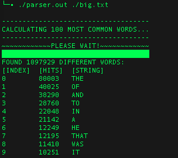

# WordParser

This wordparser takes text documents as its input and returns word counts from the text.

## Usage

- First parameter: path to text file
- example: ./parser text.txt



## Features

- Calculates 100 most common words from document if applicable
- Progress bar for tracking progress. (GRAPHICAL flag)
- Support for scandinavian characters (wchar)
- Uses hash table for quicker operation
- Quicksort for sorting words.

## Building

```sh
$ cd WordParser
$ gcc -o parser.out ./parser.c
$ ./parser.out
```

## Performance

It was found out that buffer size (#define SIZE in parser.h) impacted performance greatly. When the hashtable is small, then it can also be read quicker. However this affects the accuracy of the result.

| Words/second (MBP 2010) | Buffer size |
| ------ | ------ |
| 91494 | 1000 |
| 33270 | 5000 |
| 24398 | 10000 |
